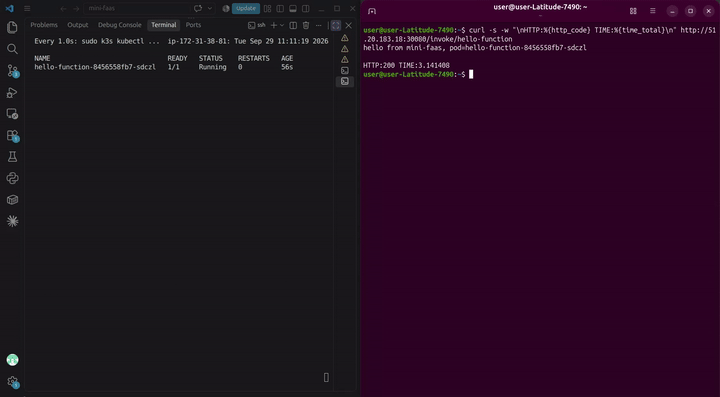

# Simple FaaS (mini-faas)

A Kubernetes-native FaaS platform built from raw primitives — a custom CRD plus a `controller-runtime` reconciler — not Knative, not OpenFaaS. The point of the project is demonstrating how a serverless control plane actually works underneath those tools, not consuming one.

[](assets/demo.webm)

Click the preview for the full demo (cold start → warm invocation → scale-to-zero).

```
                     ┌─────────────────────────────┐
                     │   Function (CRD)            │
                     │   image, port, idleTimeout,  │
                     │   minReplicas, maxReplicas   │
                     └──────────────┬───────────────┘
                                    │ watched by
                                    ▼
┌───────────────┐   reconcile   ┌─────────────────────┐
│  Controller    │◄─────────────│  Deployment + Service │
│ (manager pod)  │──creates/────►  (owned by Function)  │
└───────────────┘   updates     └─────────┬─────────────┘
                                           │
        cold start trigger                │ scales 0 ⇄ N
        (TriggeredReplicas)               ▼
┌───────────────┐   patches    ┌─────────────────────┐
│   Gateway      │─────────────►   idle-timeout loop   │
│ /invoke/{name} │              (scale-to-zero after   │
│ reverse proxy  │              idleTimeoutSeconds)    │
└───────┬────────┘              └─────────────────────┘
        │
        ▼
   /metrics ──► Prometheus (cold start count + duration histogram)
```

## Status: what's actually verified here

This is a group project, benchmarked and chaos-tested on a real cluster — not a toy that only runs a happy path once. Every number below came from a script run against a live cluster, not an estimate. Where something is untested, it's called out explicitly in its own section rather than implied by omission.

## Core mechanics

| Mechanic | Where | Verified how |
|---|---|---|
| Scale-to-zero | `function_controller.go`, idle-timeout check in the reconcile loop | Left a Function idle past `idleTimeoutSeconds`, watched the Deployment's replica count go to 0 via `kubectl get deploy -w` |
| Cold-start trigger | `cmd/gateway/main.go`, `/invoke/{name}` patches `TriggeredReplicas` | Hit a scaled-to-zero function through the gateway, confirmed pod creation in `kubectl get pods -w`, then confirmed it scaled back to zero after the idle window |
| Decoupled trigger vs. floor | `TriggeredReplicas` field, separate from `MinReplicas` | This was a real bug: the original code reused one field for both the gateway's trigger and the floor, so any gateway-triggered cold start permanently blocked scale-to-zero afterward. Fixed by splitting the field; re-tested the same idle-timeout scenario above after the fix to confirm scale-to-zero resumed working |
| Graceful shutdown | `cmd/gateway/main.go`, `SIGTERM`/`SIGINT` handling + `http.Server.Shutdown(ctx)` | See chaos test below |
| Metrics | `promauto` counter + histogram, `/metrics` on the gateway | Confirmed Prometheus (deployed in-cluster) is actually scraping the endpoint — target shows `UP` in Prometheus's own target list, and `coldStartTotal`/`coldStartDuration` return real values via PromQL |
| AWS deployment | `config/aws/*.yaml` | These manifests were pulled live off the running EC2/k3s cluster with `kubectl get ... -o yaml`, not reconstructed from memory — so what's in the repo matches what's actually deployed |

## Cold start vs. warm invocation

5 runs each, forced cold by resetting `minReplicas`/`triggeredReplicas` to zero and deleting the Deployment before each cold run (`benchmark.sh`, results in `benchmark-results.csv`):

| Run | Cold (s) | Warm (s) |
|---|---|---|
| 1 | 2.70 | 0.044 |
| 2 | 2.68 | 0.039 |
| 3 | 2.65 | 0.036 |
| 4 | 2.67 | 0.041 |
| 5 | 2.69 | 0.038 |

Cold start is roughly **65–70x** slower than a warm hit — expected for a scale-from-zero model, and the number exists because it was measured, not assumed. This is one benchmark run, not a statistically robust suite — see "What's genuinely untested."

## Resilience: graceful shutdown under load

Chaos test: send an in-flight request to a function with an artificial delay (`?delay=N` on the test function), kill the gateway pod mid-request, see what happens to that request.

- **First attempt, no shutdown handling**: pod killed instantly, in-flight request died immediately. Not acceptable for anything claiming to route live traffic.
- **Added `SIGTERM` handling with a 10s shutdown timeout**: request still died, now failing at ~14.5s — the shutdown window was too short for the in-flight request to finish.
- **Raised timeout to 25s**: request completed successfully, `200 OK` at ~15s into the delayed handler, well inside the shutdown budget. Verified two independent ways (through `kubectl port-forward` and from an in-cluster debug pod) to rule out the result being a quirk of the test method rather than the actual behavior.

## Prerequisites

- Docker
- `kind` v0.23.0 (pinned — newer alphas have breaking changes) for local development, or an AWS account for the real deployment
- `kubectl` v1.30.x
- Go 1.21+
- (optional, for the AWS path) AWS CLI v2, an EC2 instance (`t3.small` minimum — `t3.micro` is too memory-constrained for k3s)

## Setup (local, `kind`)

```bash
kind create cluster --name mini-faas
kubectl apply -f config/crd/function-crd.yaml
kubectl apply -f config/rbac/manager-rbac.yaml
kubectl apply -f config/rbac/gateway-rbac.yaml
kubectl apply -f config/deploy/manager-deployment.yaml
kubectl apply -f config/deploy/gateway-deployment.yaml
kubectl apply -f config/observability/prometheus.yaml
```

Deploy a sample function and invoke it through the gateway:

```bash
kubectl apply -f config/aws/function-sample.yaml   # works locally too, adjust image if needed
kubectl port-forward svc/mini-faas-gateway 8080:8080
curl http://localhost:8080/invoke/hello
```

## Setup (real deployment, AWS EC2 + k3s)

See `config/aws/README.md` for the full walkthrough. Short version: provision a `t3.small` EC2 instance, install k3s, apply the manifests in `config/aws/`, point a NodePort Service at the gateway.

**Known, deliberate gap**: the security group allows SSH (22) and the k3s API (6443) from `0.0.0.0/0`. That's an explicit choice, not an oversight — worth flagging if you're judging this as production-representative rather than a demo.

## Run the benchmark / chaos test yourself

```bash
./benchmark.sh        # writes benchmark-results.csv
```

Chaos test is manual: trigger a delayed invocation, then `kubectl delete pod` the gateway mid-request, and watch whether the response completes.

## What's genuinely untested

- Only one 5-run benchmark session exists — no statistically robust multi-session suite, no load testing under concurrent requests
- Prometheus is scraping and metrics are real, but there's no Grafana dashboard — numbers are read via raw PromQL, not visualized
- AWS deployment is manual (SSH + `kubectl apply`), not CI/CD-automated — no GitHub Actions pipeline for this project
- No multi-node testing — both local (`kind`) and AWS (`k3s`) runs are single-node
- No tested behavior under `MaxReplicas` saturation / backpressure
- AWS billing: free-tier assumptions haven't been reconfirmed against an actual billing-console check or budget alert

## Layout

```
api/v1alpha1/              Function CRD types + deepcopy
internal/controller/       Reconciler: Deployment/Service lifecycle, idle-timeout scale-down
cmd/manager/                Controller entrypoint (in-cluster deployment)
cmd/gateway/                HTTP gateway: cold-start trigger, reverse proxy, /metrics
functions/hello/           Minimal test function (supports ?delay=N for chaos testing)
config/crd/                 CRD manifest
config/rbac/                RBAC for manager + gateway
config/deploy/               Local (kind) Deployment/Service manifests
config/observability/        Prometheus ConfigMap + Deployment
config/aws/                  AWS/k3s manifests, pulled live from the running cluster
benchmark.sh                 Cold-vs-warm benchmark script, writes benchmark-results.csv
```